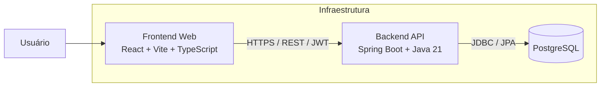
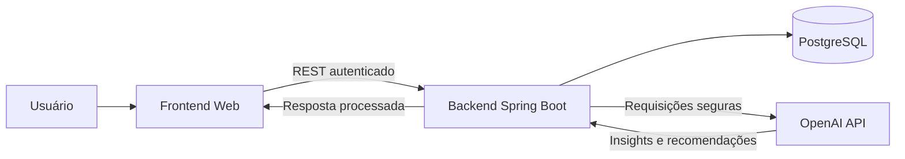
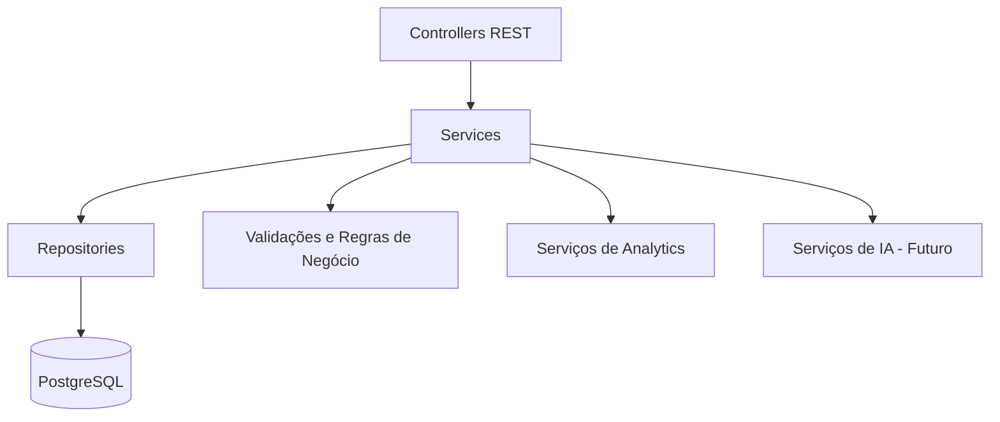
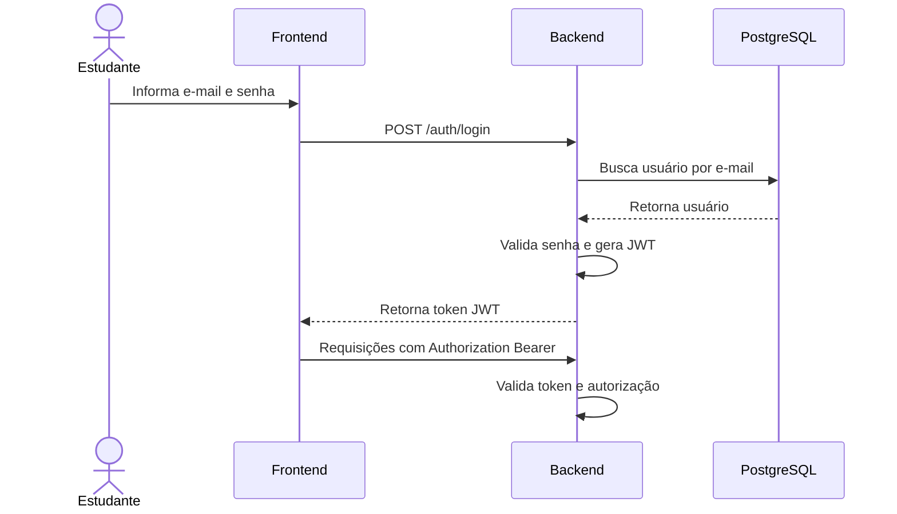

# Arquitetura do Sistema

## Visão Geral

O NeuroFlow Analytics seguirá uma arquitetura em camadas com separação clara entre interface, regras de negócio, persistência e integrações externas. Essa abordagem facilita manutenção, testes, evolução incremental e implantação em ambiente SaaS.

## Arquitetura de Alto Nível — MVP

## Arquitetura com Integração Futura de IA

## Componentes Principais

| Componente | Responsabilidade |
|---|---|
| Frontend | Interface do usuário, formulários, dashboards, gráficos, consumo de APIs e feedback visual. |
| Backend | Autenticação, autorização, regras de negócio, APIs REST, orquestração de analytics e integrações. |
| PostgreSQL | Persistência relacional de usuários, matérias, sessões, tarefas, metas, streaks e interações de IA. |
| OpenAI API | Geração futura de insights, recomendações e análises personalizadas. |
| Docker Compose | Orquestração local dos serviços de frontend, backend e banco durante desenvolvimento. |

## Camadas do Backend

### Controllers

Responsáveis por expor endpoints REST, validar contratos básicos de entrada, delegar processamento aos services e retornar respostas padronizadas.

### Services

Concentram regras de negócio, validações transacionais, cálculos de progresso, atualização de streaks e composição de dados para dashboard.

### Repositories

Responsáveis pelo acesso ao banco de dados por meio de Spring Data JPA, respeitando filtros por usuário autenticado.

### DTOs

Utilizados para separar contratos de API das entidades persistidas, reduzindo acoplamento e exposição indevida de campos internos.

## Segurança

## Princípios Arquiteturais

- Separação entre responsabilidades de apresentação, domínio e persistência.
- APIs REST como contrato principal entre frontend e backend.
- Segurança orientada por autenticação JWT e isolamento por usuário.
- Persistência relacional para consistência e rastreabilidade histórica.
- Evolução incremental para IA sem comprometer o core do produto.
- Observabilidade e documentação como partes do ciclo de engenharia.
