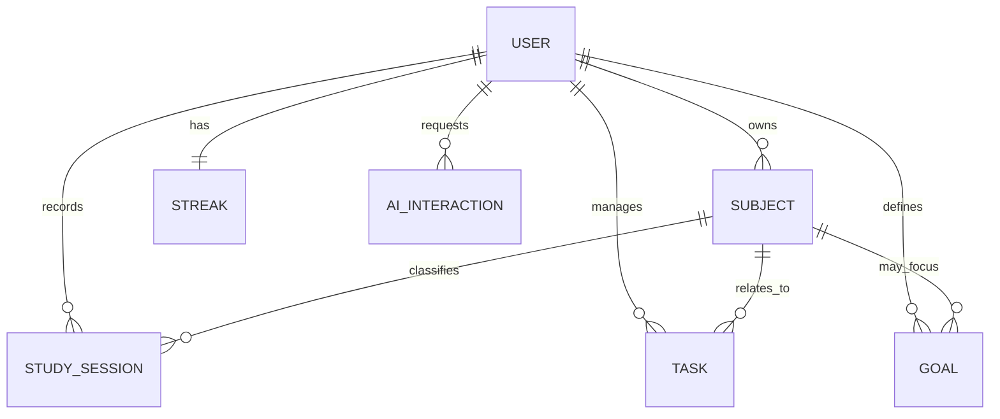

# Modelo de Domínio

## Visão Geral

O modelo conceitual do NeuroFlow Analytics representa a rotina acadêmica do estudante por meio de entidades relacionadas a usuários, matérias, sessões de estudo, tarefas, metas, streaks e interações com IA.

## Entidades Principais

| Entidade | Descrição |
|---|---|
| User | Representa o estudante cadastrado na plataforma. |
| Subject | Representa uma matéria, disciplina ou área de estudo do usuário. |
| StudySession | Representa uma sessão de estudo registrada pelo usuário. |
| Task | Representa uma tarefa acadêmica vinculada ou não a uma matéria. |
| Goal | Representa uma meta mensurável definida pelo usuário. |
| Streak | Representa a consistência diária de estudo do usuário. |
| AIInteraction | Representa uma interação futura com IA para geração de insights. |

## Diagrama Conceitual

## User

Representa uma conta de estudante. É a entidade proprietária dos dados acadêmicos.

### Atributos conceituais

- identificador único;
- nome;
- e-mail;
- senha criptografada;
- status da conta;
- data de criação;
- data de atualização.

### Relacionamentos

- Um usuário possui várias matérias.
- Um usuário registra várias sessões de estudo.
- Um usuário gerencia várias tarefas.
- Um usuário define várias metas.
- Um usuário possui um controle de streak.
- Um usuário pode possuir várias interações com IA.

## Subject

Representa uma matéria ou disciplina utilizada para organizar estudos, tarefas e metas.

### Atributos conceituais

- identificador único;
- usuário proprietário;
- nome;
- descrição;
- cor;
- status ativo/inativo;
- data de criação.

### Relacionamentos

- Uma matéria pertence a um usuário.
- Uma matéria pode possuir várias sessões de estudo.
- Uma matéria pode estar vinculada a várias tarefas.
- Uma matéria pode ser foco de metas específicas.

## StudySession

Representa uma atividade real de estudo executada pelo estudante.

### Atributos conceituais

- identificador único;
- usuário proprietário;
- matéria;
- data;
- início;
- fim;
- duração em minutos;
- tipo de estudo;
- nível de foco;
- observações.

### Relacionamentos

- Uma sessão pertence a um usuário.
- Uma sessão pode estar associada a uma matéria.
- Sessões alimentam analytics, metas e streaks.

## Task

Representa uma atividade acadêmica a ser acompanhada.

### Atributos conceituais

- identificador único;
- usuário proprietário;
- matéria opcional;
- título;
- descrição;
- prioridade;
- status;
- prazo;
- data de conclusão.

### Relacionamentos

- Uma tarefa pertence a um usuário.
- Uma tarefa pode estar relacionada a uma matéria.
- Tarefas concluídas alimentam métricas de produtividade.

## Goal

Representa uma meta de produtividade ou desempenho acadêmico.

### Atributos conceituais

- identificador único;
- usuário proprietário;
- matéria opcional;
- tipo de meta;
- valor alvo;
- unidade;
- período inicial;
- período final;
- status.

### Relacionamentos

- Uma meta pertence a um usuário.
- Uma meta pode ser geral ou focada em uma matéria.
- O progresso é derivado de sessões e tarefas.

## Streak

Representa a consistência de estudo do usuário.

### Atributos conceituais

- identificador único;
- usuário proprietário;
- streak atual;
- melhor streak;
- última data com sessão válida;
- data de atualização.

### Relacionamentos

- Um streak pertence a um único usuário.
- É atualizado a partir de sessões de estudo válidas.

## AIInteraction

Representa uma solicitação de análise ou recomendação feita à camada de IA.

### Atributos conceituais

- identificador único;
- usuário proprietário;
- tipo de interação;
- prompt contextual resumido;
- resposta gerada;
- modelo utilizado;
- data da solicitação.

### Relacionamentos

- Uma interação pertence a um usuário.
- Interações utilizam dados acadêmicos autorizados como contexto.
