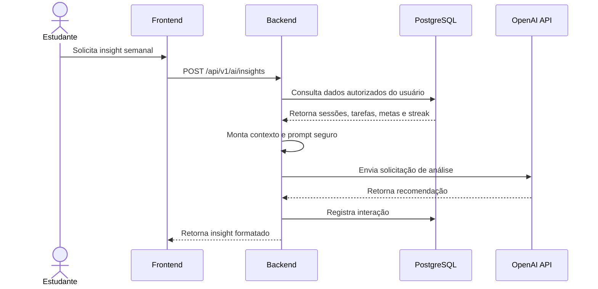

# Roadmap — V2: Integração de IA e Analytics Avançado

## Objetivo

A V2 tem como objetivo transformar o NeuroFlow Analytics de uma plataforma de acompanhamento para um assistente acadêmico inteligente, capaz de gerar recomendações personalizadas com base no histórico real de estudo do usuário.

## Escopo Principal

| Funcionalidade | Descrição | Valor para o Usuário |
|---|---|---|
| Insights com IA | Geração de análises personalizadas sobre rotina de estudo. | Entendimento claro de pontos fortes e fracos. |
| Recomendações semanais | Sugestões de prioridades para a próxima semana. | Melhor planejamento acadêmico. |
| Alertas de metas em risco | Identificação de metas com baixa probabilidade de conclusão. | Correção antecipada da rotina. |
| Resumo de produtividade | Relatório textual com desempenho do período. | Reflexão estruturada sobre evolução. |
| Analytics por tendência | Comparações semanais e mensais. | Visibilidade de progresso real. |
| Histórico de interações de IA | Registro de insights solicitados. | Rastreabilidade e consulta posterior. |

## Integração com OpenAI API

A integração deve ser implementada por meio de uma camada específica no backend, responsável por montar contexto, chamar a API externa, tratar respostas e registrar interações.

## Cuidados Técnicos

| Tema | Diretriz |
|---|---|
| Privacidade | Enviar somente dados necessários e autorizados do usuário. |
| Segurança | Nunca expor chaves da OpenAI no frontend. |
| Custo | Controlar volume de chamadas e tamanho do contexto. |
| Auditoria | Registrar tipo de interação, contexto resumido e resposta. |
| Qualidade | Padronizar prompts e validar respostas antes de exibir. |
| Resiliência | Tratar indisponibilidade da API externa com mensagens adequadas. |

## Exemplos de Insights Planejados

- “Você estudou menos Matemática nas últimas duas semanas em comparação com outras matérias.”
- “Sua meta semanal está em risco porque apenas 30% foi concluída até agora.”
- “Seu melhor horário de estudo parece ocorrer no período da manhã, com maior nível de foco registrado.”
- “Recomenda-se priorizar tarefas com prazo próximo e matérias com baixa carga horária recente.”

## Critérios de Sucesso da V2

- Insights gerados com contexto real do usuário.
- Registro histórico de interações com IA.
- Redução de respostas genéricas por meio de prompts estruturados.
- Melhor compreensão do usuário sobre prioridades acadêmicas.
- Integração isolada e preparada para evolução futura.
